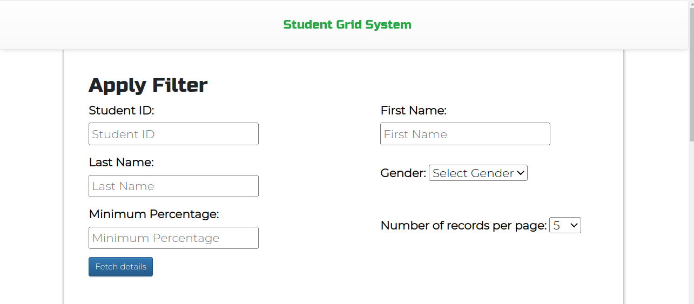
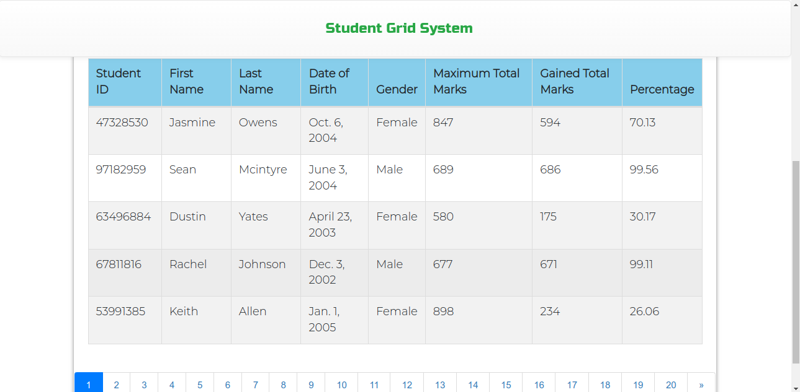

# Kinara Capital SDE Home assignment
A Web application to fetch to view the Students details. The platform has pagination and filtering functionalities to view the students data.

### [Assignment Hosted Link](http://shravanksubrahmanya.pythonanywhere.com/)

### Objective:
The objective of this test assignment is to develop a grid system with filtering functionality in the backend. The grid system is designed to display student details(id, name , total marks etc) and allow filtering based on various columns. 
The assignment involves developing the backend APIs responsible for loading student details with pagination, and implementing server-side filtering.

### Frameworks used:
* Django
* python 3.11

### Frontend
* HTML
* CSS
* Javascript
* Jquery

### installing the project
* clone the git repository
* create a virtual environment using conda
* install django4.1
* install the following packages
  * pip install pillow
  * pip install django
  * pip install django-bootstrap4
  * pip install django_select2
  * pip install paginator
* cd into the first 'kinara_capital_assignment' folder
* populate the Student table using the following command
    * python populate_student.py
* run the project using command - 'python manage.py runserver'

### Credentials
* for superuser login
    * username: arihant
    * password: 123456789

## Further help

Connect me using my linkedin link [Linkedin](https://www.linkedin.com/in/shravan-k-s-4a04ba155/) page.

## Screenshots:
* all of the screenshots of the project are provided in the 'screenshots' folder. The screenshots folder is not a part of the project

